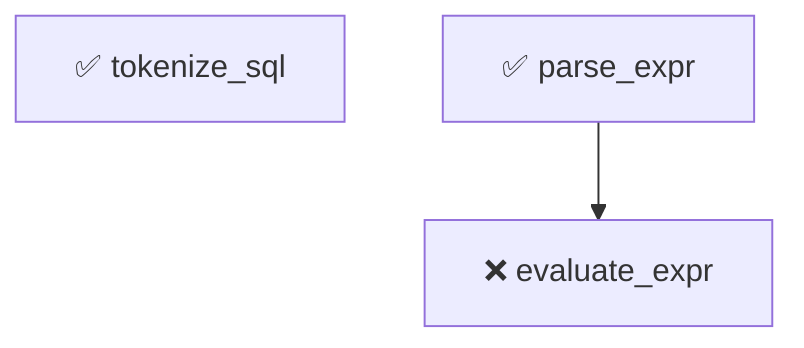

# FOUNDRY_SETUP.md — Open WebUI as Foundry GUI

> **Phase 2 Handoff** · Generated 2026-07-21 · Open WebUI v0.10.2 + Foundry Manager v0.2.0
> **W8 Update** · 2026-07-21 · DAG/Manifest panels delivered via Mermaid rendering

## Architecture
```
┌──────────────────────┐
│   Open WebUI GUI     │  http://localhost:3000
│   (Svelte frontend)  │
│   forked at v0.10.2  │
└──────────┬───────────┘
           │ /v1/chat/completions (SSE streaming)
           ▼
┌──────────────────────┐
│  Foundry Manager     │  http://localhost:8000
│  + OpenAI shim       │  /v1/chat/completions → Manager pipeline
│  (FastAPI backend)   │  /v1/models (virtual model)
└──────────┬───────────┘
           │
     ┌─────┴─────┐
     ▼           ▼
┌─────────┐ ┌──────────┐
│ Foundry │ │Traditional│
│Executor │ │  Agent   │
└─────────┘ └──────────┘
```

## Quick Start
### 1. Start Foundry Manager (backend)

```bash
cd "C:\Users\reese\Projects\Foundry Manager"
.venv\Scripts\python.exe -m uvicorn foundry_manager.api.app:app --host 127.0.0.1 --port 8000
```

Verify: `curl http://127.0.0.1:8000/api/health` → `{"status":"ok"}`

### 2. Start Open WebUI (GUI)

```bash
cd "C:\Users\reese\Projects\open-webui-foundry"

# Set environment variables
set OPENAI_API_BASE_URL=http://127.0.0.1:8000/v1
set OPENAI_API_KEY=foundry-manager
set OLLAMA_BASE_URL=
set DATA_DIR=C:\Users\reese\Projects\open-webui-foundry\data
set DATABASE_URL=sqlite:///C:\Users\reese\Projects\open-webui-foundry\data\webui.db
set WEBUI_AUTH=true
set WEBUI_SECRET_KEY=your-secret-key-here
set OAUTH_SESSION_TOKEN_ENCRYPTION_KEY=your-oauth-key-here

# Start
.venv\Scripts\open-webui.exe serve --host 127.0.0.1 --port 3000
```

Verify: `curl http://127.0.0.1:3000/api/config` → `{"status":true,...}`

### 3. First-time Setup

1. Open `http://localhost:3000` in your browser
2. Sign up with admin credentials (first user becomes admin)
3. The `foundry-manager` model should appear in the model selector
4. Start chatting — messages route through the Manager's planning pipeline

## What Works

### ✅ Chat Streaming (end-to-end verified)
- Open WebUI → `/v1/chat/completions` → Manager shim → Manager pipeline → streaming SSE response
- Both streaming and non-streaming modes work
- Content deltas arrive in real-time

### ✅ Model Selection
- `foundry-manager` model is automatically discovered from the shim's `/v1/models` endpoint
- Model appears in Open WebUI's model selector dropdown

### ✅ Foundry Pipeline Tools (5 registered)
Five tools are registered in Open WebUI:

| Tool | ID | Purpose |
|------|----|---------|
| **Foundry Dashboard** | `foundry_dashboard` | Fetches `GET /api/monitoring/dashboard` + `/api/monitoring/summary` + `/api/monitoring/tasks/active` |
| **Foundry Artifacts** | `foundry_artifacts` | Fetches `GET /api/tasks/{id}/artifacts` with existence verification |
| **Foundry Audit** | `foundry_audit` | Reads run manifests and renders the honest ledger (behavioral/partial/weak/existence tiers) |
| **Foundry DAG Visualizer** | `foundry_dag` | Reads `dag.yaml` files and renders dependency graphs as **Mermaid diagrams** with verification status overlay |
| **Foundry Manifest Viewer** | `foundry_manifest` | Reads run manifests and renders per-unit verification tables + **Mermaid pie charts** of tier distribution |

Tools are invoked via Open WebUI's tool-calling mechanism when enabled in the chat model settings.

### ✅ DAG/Manifest Panels (Mermaid Rendering)

**This is the key Phase 2 deliverable.** Open WebUI natively renders ` ```mermaid ` code blocks as SVG diagrams in chat messages. The new tools return markdown containing Mermaid diagrams, which Open WebUI renders automatically — no core surgery needed.

**How it works:**
1. The `foundry_dag` tool reads a `dag.yaml` file from the harness
2. It generates a Mermaid `graph TD` diagram with color-coded nodes:
   - 🟢 Green = behavioral (fully verified)
   - 🟡 Yellow = partial verification
   - 🟠 Orange = weak verification
   - 🔴 Red = failed
   - ⬜ Gray = pending/not run
3. The tool returns markdown with a ` ```mermaid ` code block
4. Open WebUI's `CodeBlock.svelte` detects the language and renders it as an SVG

**Similarly for manifests:**
1. The `foundry_manifest` tool reads a manifest JSON from disk
2. It generates a markdown table of per-unit verification status
3. It includes a Mermaid `pie` chart of tier distribution
4. Open WebUI renders both the table and the pie chart

**Verified with real artifacts:**
- `get_foundry_dag('text_query')` → 32-unit DAG with 13 verified (green) + 15 failed (red)
- `get_foundry_dag('string_utils')` → 4-unit DAG (all pending, no dependencies)
- `get_foundry_manifest('cam4_proof14')` → 20/20 units behaviorally verified, pie chart shows 100%
- `get_foundry_manifest('text_query_proof8')` → 13/28 verified, pie chart shows tier split
- `list_foundry_manifests()` → table of all 8 cam4 runs with verification rates

**Data source:** Tools read directly from disk (`C:\Users\reese\Projects\Compartmentalized Software Development\`). No synthetic data — every claim traces to a real artifact.

### ✅ Session Persistence
- Open WebUI stores chat history in SQLite (`data/webui.db`)
- Session memory persists across browser refreshes

## Known Gaps & Limitations

### ⚠️ Tool Routing Gap
**Issue:** Open WebUI's tool-calling requires the LLM to generate tool_call responses. When routing through the Manager shim, the Manager's GLM 5.2 model uses its own tool definitions (foundry executor, traditional agent) rather than Open WebUI's registered tools. This means:
- The Open WebUI tools (`foundry_dashboard`, `foundry_artifacts`, `foundry_audit`, `foundry_dag`, `foundry_manifest`) are registered but NOT automatically invoked during Manager-routed chat
- They ARE available when using Open WebUI with a direct OpenAI-compatible model (not through the Manager)

**Workaround:** Users can manually call the tools via the Open WebUI UI's tool panel, or use the Foundry Manager's REST API directly.

**Future fix:** Extend the shim to pass Open WebUI's tool definitions through to the Manager, or create a separate Open WebUI model endpoint that bypasses the Manager and calls tools directly.

### ⚠️ Old UI Not Deleted
Per §5 Phase 2, the old `foundry_manager/static/index.html` (~1000 lines vanilla JS) is NOT deleted. The retirement decision is left to the user once parity is verified.

### ⚠️ Port Conflicts
The Manager runs on port 8000 and Open WebUI on port 3000. If either port is occupied, adjust the `--port` flag and update the `OPENAI_API_BASE_URL` accordingly.

## Tool Reference

### `get_foundry_dag(project_path, include_status=True)`
Renders a foundry project's dependency graph as a Mermaid diagram.

**Arguments:**
- `project_path` (str): Path shortcut or relative path. Shortcuts: `text_query`, `string_utils`, `letter_frequency`, `root`. Or a relative path from `C:\Users\reese\Projects\Compartmentalized Software Development\`.
- `include_status` (bool): Overlay verification status from manifest. Default `True`.

**Example output (Mermaid):**


### `list_foundry_projects()`
Lists available foundry projects with DAG files and verification counts.

### `get_foundry_manifest(run_id, include_chart=True)`
Renders a run manifest as a structured audit report with Mermaid pie chart.

**Arguments:**
- `run_id` (str): Run ID (e.g. `cam4_proof14`, `text_query_proof8`).
- `include_chart` (bool): Include Mermaid pie chart. Default `True`.

**Example output:** Markdown table of all units with status/oracle/rung/attempts, plus a pie chart showing tier distribution.

### `list_foundry_manifests()`
Lists all available manifests with verification rates.

### `get_foundry_dashboard()`
Fetches the real-time monitoring dashboard from the Manager API.

### `get_foundry_artifacts(task_id)`
Shows a task's artifacts with existence verification.

### `get_foundry_audit(run_id)`
Reads a manifest and renders the honest ledger (§7 compliant).

## File Locations

| File | Location | Purpose |
|------|----------|---------|
| OpenAI shim | `Foundry Manager/foundry_manager/api/openai_compat.py` | `/v1/chat/completions` endpoint |
| Shim tests | `Foundry Manager/tests/api/test_openai_compat.py` | 10 tests for the shim |
| Dashboard tool | `open-webui-foundry/backend/open_webui/tools/foundry/foundry_dashboard.py` | Monitoring dashboard |
| Artifacts tool | `open-webui-foundry/backend/open_webui/tools/foundry/foundry_artifacts.py` | Task artifact viewer |
| Audit tool | `open-webui-foundry/backend/open_webui/tools/foundry/foundry_audit.py` | Honest audit ledger |
| **DAG tool** | `open-webui-foundry/backend/open_webui/tools/foundry/foundry_dag.py` | DAG → Mermaid diagram |
| **Manifest tool** | `open-webui-foundry/backend/open_webui/tools/foundry/foundry_manifest.py` | Manifest → table + pie chart |

## Environment Variables

### Foundry Manager
| Variable | Required | Purpose |
|----------|----------|---------|
| `GLM_ADVISOR_API_KEY` | Preferred | GLM 5.2 API key |
| `OPENROUTER_API_KEY` | If no GLM key | General OpenRouter account |

### Open WebUI
| Variable | Required | Purpose |
|----------|----------|---------|
| `OPENAI_API_BASE_URL` | Yes | `http://127.0.0.1:8000/v1` |
| `OPENAI_API_KEY` | Yes | Any value (Manager handles auth) |
| `OLLAMA_BASE_URL` | Set to `""` | Disable Ollama |
| `DATA_DIR` | Yes | `C:\Users\reese\Projects\open-webui-foundry\data` |
| `DATABASE_URL` | Yes | SQLite URL for persistence |
| `WEBUI_AUTH` | Yes | `true` for auth, `false` to disable |
| `WEBUI_SECRET_KEY` | If auth=true | Session encryption key |
| `OAUTH_SESSION_TOKEN_ENCRYPTION_KEY` | Yes | OAuth encryption key |

## Dependencies

### Foundry Manager (existing)
- FastAPI, uvicorn, pydantic, httpx, pyyaml, sse-starlette, python-dotenv

### Open WebUI (vendored fork)
- Full dependency list in `open-webui-foundry/pyproject.toml`
- Installed via `uv pip install -e "."` into `.venv/`
- Includes: FastAPI, SQLAlchemy, sentence-transformers (RAG), torch, transformers

## Testing

### Shim Tests (in Foundry Manager)
```bash
cd "C:\Users\reese\Projects\Foundry Manager"
.venv\Scripts\python.exe -m pytest tests/api/test_openai_compat.py -v
# 10 tests: models endpoint, non-streaming, streaming SSE, error handling
```

### Full Test Suite
```bash
cd "C:\Users\reese\Projects\Foundry Manager"
.venv\Scripts\python.exe -m pytest tests/ -v
# 230 tests passing (220 existing + 10 shim)
```

## Git History

### Foundry Manager
```
5b3390e feat: add OpenAI-compatible /v1/chat/completions shim for Open WebUI integration
```

### Open WebUI Fork
```
ecd48e2f7 0.10.2 (upstream clone)
[foundry] Add foundry pipeline tools and setup documentation
[foundry] Add DAG visualizer and manifest viewer tools with Mermaid rendering
```

## Next Steps (Phase 3+)

1. **Tool routing fix**: Pass Open WebUI tools through the shim to the Manager, or create a direct-model endpoint
2. **Pipeline panels**: Consider Open WebUI's Pipeline system for intercepting/transforming chat (alternative to tools)
3. **Frontend customization**: If deeper integration needed, fork Open WebUI's Svelte frontend per §6
4. **Old UI retirement**: Delete `foundry_manager/static/index.html` once parity is confirmed by user
